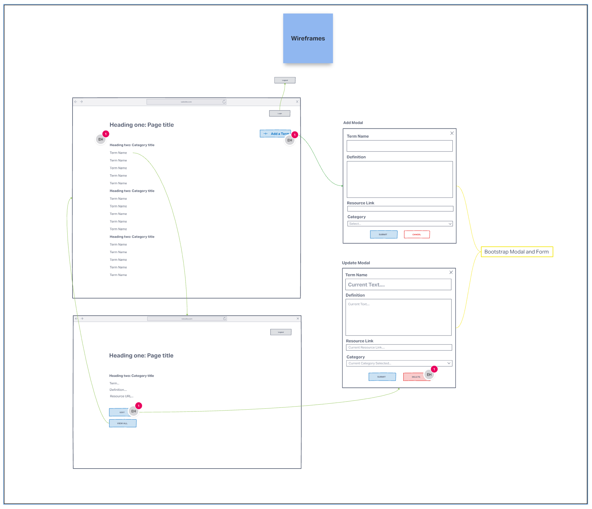
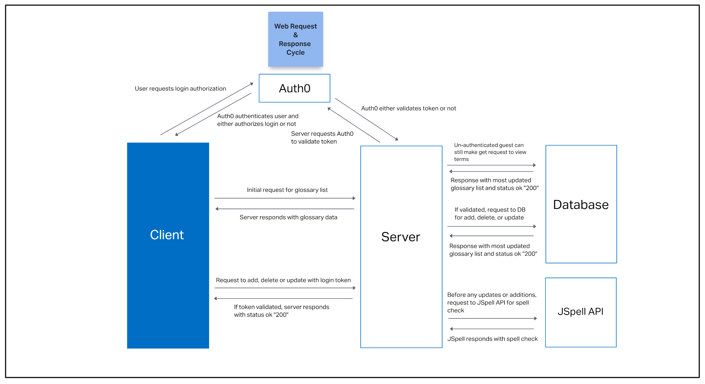
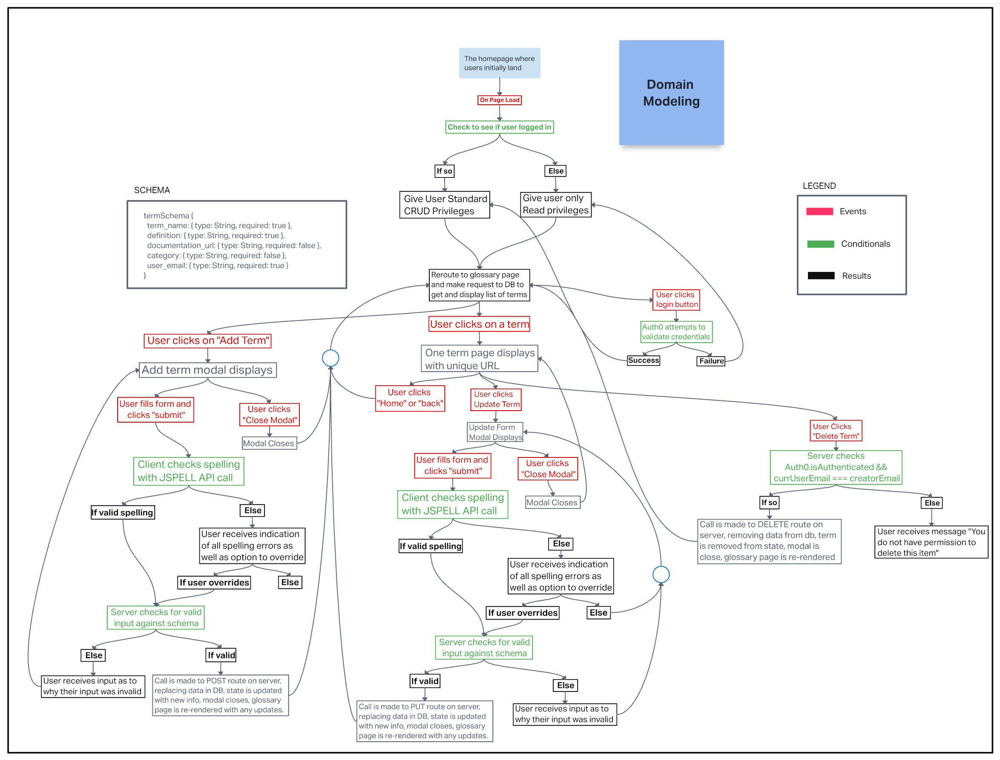

# Code Fellows Coding Glossary App

## Deployed Site

[Link to deployed Netlify site](https://code-fellows-glossary.netlify.app)

## Authors

- Guy Farley
- Benjamin Small
- Elizabeth Hammes
- Brady Davenport

## Problem Domain

This project was brought to my cohort by the VP of Education at Code Fellows, as a suggestion for a real-world application that could be completed for our final project. Students at Code Fellows needed a better way to keep track of all the terms they were being taught, and this app would help with that. The client's primary requirements were as follows:

- To maintain a database encompassing all terms relevant to the coursework, and to present those terms in an aesthetically pleasing way to the user
- To allow students to log into an account in order to view, update, and delete terms
- To allow the user to review spelling errors before submitting a new or updated term, to ensure all terms remained correctly spelled and grammatically correct

## Features / Routes

- Glossary term data is stored and accessed within a MongoDB database, making use of an Express server on the backend to handle all CRUD operations via Mongoose
- Auth0 is used to manage authorization/authentication, wherein a token is requested and received based on successful login
- Unauthorized users can still view all terms currently in the database. These terms are retrieved by an initial GET request
- Authorized users gain access to additional features of the site, including the ability to update, add, or delete a term via REST requests to our backend server
- Upon submission of a term addition or update, the data is sent by our server to a 3rd party API (JSpell). JSpell responds with information regarding any misspellings, which trigger an alert modal that requests the user to review and either (1) override and submit as-is, or (2) correct the spelling and re-submit

## Challenges & Constraints

**Challenge:** Working strictly with class components in React

- Having only learned class component architecture at the 301 level, my team was required to manage state entirely through passing props down from component to component. This obviously created additonal complexity, especially when dealing with role-based access and managing responses from the 3rd party API. But it was a fantastic learning experience to wrap our heads around how components relate to each other within an app, and how state should be managed accordingly

**Challenge:** Bootstrap modal functionality

- To correctly display the modals at the appropriate times, with the appropriate features (based on role access) required some additonal variables and modal handlers to be created and managed in state. While this was difficult to get right, it ultimately helped to cement our understanding of state/props management of data throughout the app

## Visual Documentation

### Wireframe

### Web Request/Response Cycle

### Domain Model

## Links and Resources

<https://reactjs.org/>

<https://auth0.com/docs/>

<https://ria.directory>

<https://react-bootstrap.github.io/>

<https://www.npmjs.com/package/axios>
